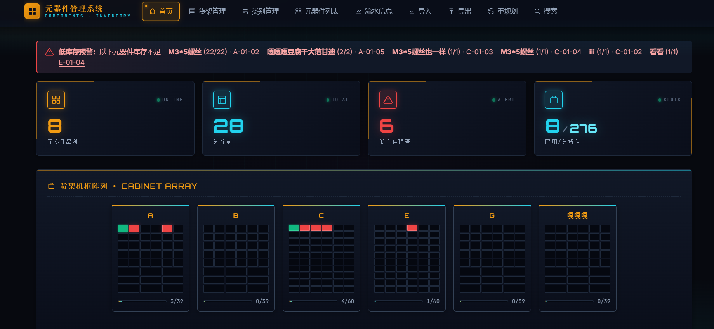

# 元器件管理系统 v1.0

一个基于 Flask 的电子元器件库存管理系统,支持智能分类、货位管理、批量导入导出等功能。

## ✨ 核心功能

- 📦 **货架管理**: 可视化货架布局,支持多行多列配置
- 🔧 **元器件CRUD**: 完整的增删改查操作
- 📊 **库存管理**: 入库/出库/调整,完整的流水记录
- 🤖 **智能分类**: 自动识别元器件类型(电阻、电容、IC等)和封装
- 📥 **Excel导入导出**: 支持批量导入和模板下载
- 🗺️ **货位规划**: 智能布局算法和重规划功能
- 🏷️ **类别管理**: 支持多级分类体系(45+预定义类别)
- 🔍 **搜索功能**: 按名称、型号快速检索
- 🖼️ **图片管理**: 支持元器件图片上传和管理
- ⚠️ **低库存预警**: 实时监控库存状态
- 📈 **数据统计**: 首页仪表盘展示关键指标

## 🛠️ 技术栈

- **后端**: Python 3.x + Flask 3.0+
- **数据处理**: openpyxl (Excel读写)
- **数据存储**: JSON文件(计划迁移到SQLite)
- **前端**: HTML5 + CSS3 + JavaScript
- **UI风格**: 深色主题,响应式设计

## 📋 安装与运行

### 前置要求

- Python 3.8+
- pip

### 安装步骤

```bash
# 1. 克隆仓库
git clone <repository-url>
cd 元器件管理系统v1.0

# 2. 安装依赖
pip install -r requirements.txt

# 3. 启动服务
python app.py

# 或使用启动脚本(Windows)
start.vbs
```

### 访问地址

```
http://127.0.0.1:5000
```

## 📁 项目结构

```
元器件管理系统v1.0/
├── app.py                 # Flask主应用
├── classifier.py          # 智能分类引擎
├── requirements.txt       # Python依赖
├── start.vbs             # Windows启动脚本
├── templates/            # HTML模板
│   ├── base.html         # 基础模板
│   ├── index.html        # 首页仪表盘
│   ├── component_*.html  # 元器件相关页面
│   ├── shelf_*.html      # 货架相关页面
│   └── ...
├── static/               # 静态资源
│   └── style.css         # 样式文件
├── data/                 # 数据目录(不提交到Git)
│   ├── components.json   # 元器件数据
│   ├── shelves.json      # 货架配置
│   ├── stock_logs.json   # 库存流水
│   ├── categories.json   # 类别定义
│   └── images/           # 元器件图片
└── scripts/legacy/       # 历史修复脚本(可删除)
```

## 🎯 使用指南

### 1. 创建货架

1. 进入"货架管理"
2. 点击"添加货架"
3. 设置货架名称和行列配置
4. 保存

### 2. 添加元器件

**方式一: 手动添加**
- 进入"元器件列表" → "添加元器件"
- 填写名称、规格、数量等信息
- 选择货位(可选)

**方式二: Excel批量导入**
- 进入"导入"页面
- 下载模板
- 填写数据后上传
- 确认导入

### 3. 库存操作

- **入库**: 元器件详情 → 入库
- **出库**: 元器件详情 → 出库
- **查看历史**: 元器件详情 → 查看流水

### 4. 智能规划

- 进入"重规划"页面
- 系统自动按类别分组并推荐货位
- 确认后执行调整

## 🔒 数据安全

⚠️ **重要提示**: 
- `data/` 目录包含用户数据,**不应提交到Git**
- 已配置 `.gitignore` 自动排除数据文件
- 建议定期备份 `data/` 目录

### 备份方法

```bash
# 手动备份
cp -r data data_backup_$(date +%Y%m%d)

# 或复制整个项目文件夹
```

## 🚀 优化建议

详见项目中的优化报告,主要方向包括:

1. **安全性**: CSRF保护、输入验证、文件上传加固
2. **性能**: 数据库迁移(SQLite)、缓存机制、分页功能
3. **代码质量**: 重构重复代码、完善异常处理
4. **功能增强**: RESTful API、统计报表、自动备份

## 📝 开发规范

### Git提交规范

```bash
feat: 新功能
fix: 修复bug
docs: 文档更新
style: 代码格式
refactor: 重构
test: 测试相关
chore: 构建/工具链
```

### 分支策略

- `main`: 主分支,稳定版本
- `develop`: 开发分支
- `feature/*`: 功能分支
- `hotfix/*`: 紧急修复

## 🐛 问题反馈

如遇到问题,请提供:
1. 操作步骤
2. 预期结果
3. 实际结果
4. 错误截图(如有)

## 📄 许可证

本项目仅供学习和内部使用。

## 🙏 致谢

感谢所有为项目做出贡献的开发者!

---

**版本**: v1.0.0  
**最后更新**: 2026-07-01
